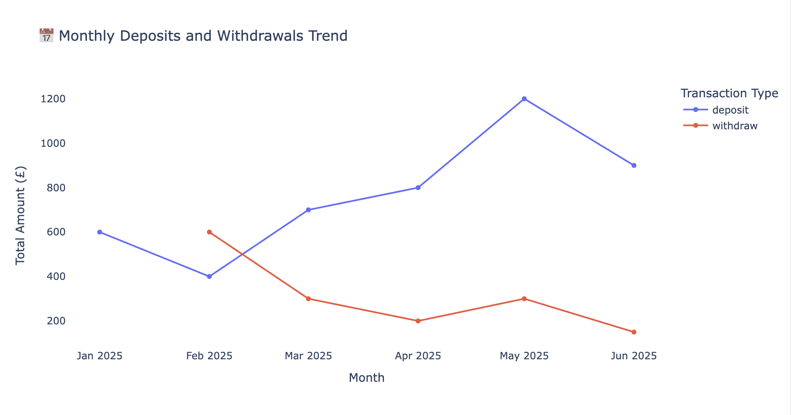

# 🏦 Data Engineering Banking Project  

**Author:** Mahesh Nilewar  
**Role:** Aspiring Data Engineer  
**Database:** PostgreSQL (`banking_db`)  
**Tools:** Python · Pandas · SQLAlchemy · Plotly · DBeaver  

---

## 📘 Project Overview
This project demonstrates a **complete data engineering workflow** — from data extraction and transformation in PostgreSQL to building a fully interactive financial dashboard using Plotly.

The goal is to simulate a small banking system with customers and their transactions to showcase:
- **ETL processes** using Python and SQLAlchemy  
- **Data transformations** and aggregations with Pandas  
- **Interactive dashboarding** using Plotly  
- **Clean modular project structure** used in real-world data engineering

## 📊 Dashboard Preview


---

## ⚙️ Tech Stack
| Category | Tools |
|-----------|--------|
| Programming | Python 3.12 |
| Database | PostgreSQL 15 |
| ORM / Connector | SQLAlchemy, psycopg2 |
| Visualization | Plotly 6.1.1 |
| Data Handling | Pandas |
| IDE / Tools | DBeaver, Jupyter Notebook |

---

## 📁 Folder Structure
data_engineering_banking_project/
│
├── config/ → database connection file (db_config.py)
├── etl/ → extraction and transformation scripts
├── visuals/ → Plotly dashboard script
├── data/output/ → notebook & generated HTML dashboard
├── logs/ → stores pipeline run logs
├── requirements.txt → Python dependencies
└── README.md → this file


---

## 🚀 How to Run

### 1️⃣ Clone the repository
```bash
git clone https://github.com/maheshnilewar/data_engineering_banking_project.git
cd data_engineering_banking_project

2️⃣ Create a virtual environment
python -m venv .venv
source .venv/bin/activate

3️⃣ Install dependencies
pip install -r requirements.txt

4️⃣ Configure database connection
user = "postgres"
password = "yourpassword"
host = "localhost"
port = 5432
database = "banking_db"

5️⃣ Run ETL and Dashboard
python etl/extract_load.py
python visuals/dashboard_combined.py

6️⃣ View your dashboard
data/output/banking_dashboard.html

📊 Dashboard Features

💰 Customer Balances: Net funds per customer after deposits/withdrawals

📅 Monthly Trends: Deposit vs Withdrawal trends over time

🌆 City Insights: Top 5 cities by total deposits

Interactive Hover, Zoom, and Export Options

🧠 Learning Outcomes

By completing this project, you’ll understand how to:

Connect Python to PostgreSQL using SQLAlchemy

Perform ETL with Pandas

Automate reporting pipelines

Design clean, modular project structures

Build and share interactive dashboards

🏁 Next Steps

Automate daily dashboard refresh via Python scheduling or Airflow

Deploy dashboard to cloud (Streamlit / Dash / AWS S3)

Add monitoring logs inside /logs/

© 2025 Mahesh Nilewar
Data Engineering Banking Project


---

## ✅ Step 2 — Verify before pushing

Check that your README is saved in:
/Users/maheshnilewar/Documents/Github/data_engineering_banking_project/README.md


Then add and push it to GitHub:

```bash
cd /Users/maheshnilewar/Documents/Github/data_engineering_banking_project
git add README.md
git commit -m "Added professional README.md with project overview"
git push
